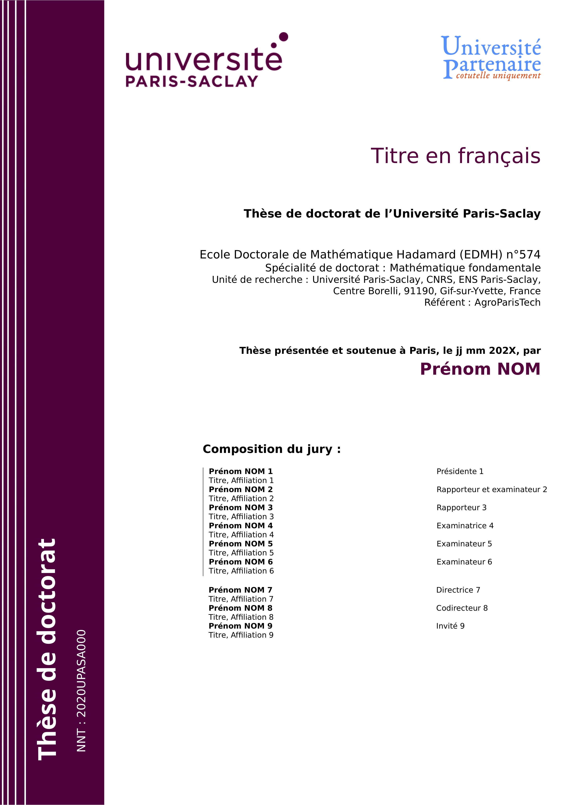
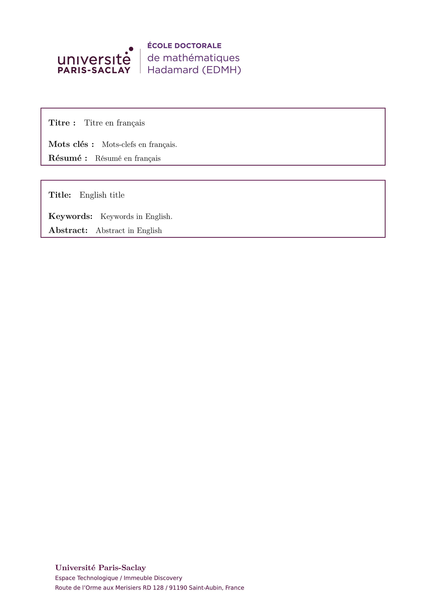
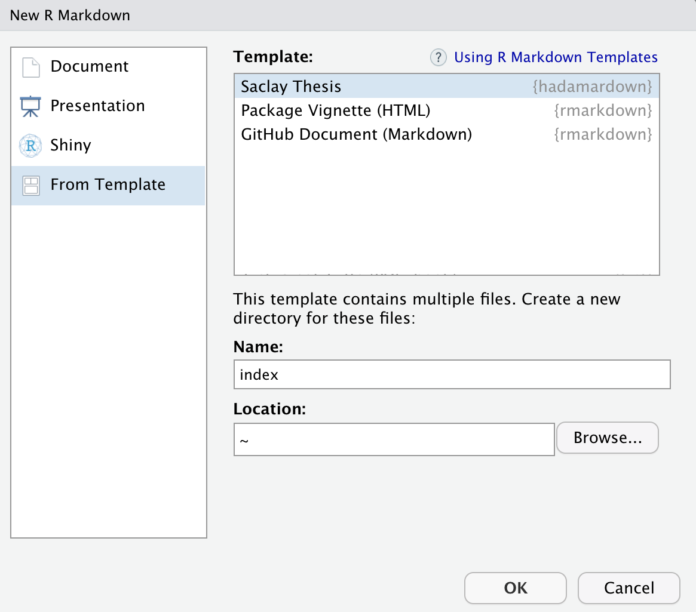

<!-- README.md is generated from README.Rmd. Please edit that file -->

```{r, include = FALSE}
knitr::opts_chunk$set(
  collapse = TRUE,
  comment = "#>",
  fig.path = "man/figures/README-",
  out.width = "100%"
)
```

# hadamardown

<!-- badges: start -->
```{r, echo = FALSE}
version <- as.vector(read.dcf('DESCRIPTION')[, 'Version'])
version <- gsub('-', '.', version)
```

[](https://www.tidyverse.org/lifecycle/#stable)
[](https://github.com/abichat/hadamardown/actions)
)`-yellowgreen.svg)
<!-- badges: end -->


The **hadamardown** package provides a handy template to write a PhD thesis for **Université Paris-Saclay** and **École Doctorale de Mathématiques Hadamard** with R and markdown. It is based on the [thesisdown](https://github.com/ismayc/thesisdown) package.

`r emo::ji("warning")` Don't forget to check that the templates provided by **hadamardown** are up to date with the official ones. If not, please fill an [issue](https://github.com/abichat/hadamardown/issues/new). 


## Installation

You can install **hadamardown** from GitHub with:

```{r installation, eval=FALSE}
# install.packages("remotes")
remotes::install_github("abichat/hadamardown")
```


## Example

Front page            |  Back cover
:-------------------------:|:-------------------------:
  |  


Official Saclay templates are provided [here](https://www.universite-paris-saclay.fr/research/textes-de-reference/documents-de-reference-relatifs-la-soutenance-de-la-these#model-cover).

The HTML output is the same as the [thesisdown one](https://thesisdown.netlify.com).

## Using hadamardown

You can find general documentation for [bookdown](https://bookdown.org/yihui/bookdown/) or [thesisdown](https://github.com/ismayc/thesisdown) on their respective pages.

Once you have LaTeX, RStudio and **hadamardown** installed on your computer (check [here](https://github.com/ismayc/thesisdown#using-thesisdown-from-chesters-github)), use 
`File > New File > R Markdown... > From template` and then select EDMH Thesis.

 

You need to use `index` for the name (to ensure you have a `index.html` file at the end) but you can change your directory name later. 

You need to fill fields in the YAML to customize your manuscript according to Saclay and EDMH standards.


Please feel free to create an issue or a pull request if you notice a typo or a lack of updates in graphics guidelines or you want to contribute to the package.


## Manuscripts with hadamardown

* [Discovering multi-scale metagenomic signatures through hierarchical organization of species](https://abichat.github.io/thesis/) by Antoine Bichat (2020).
