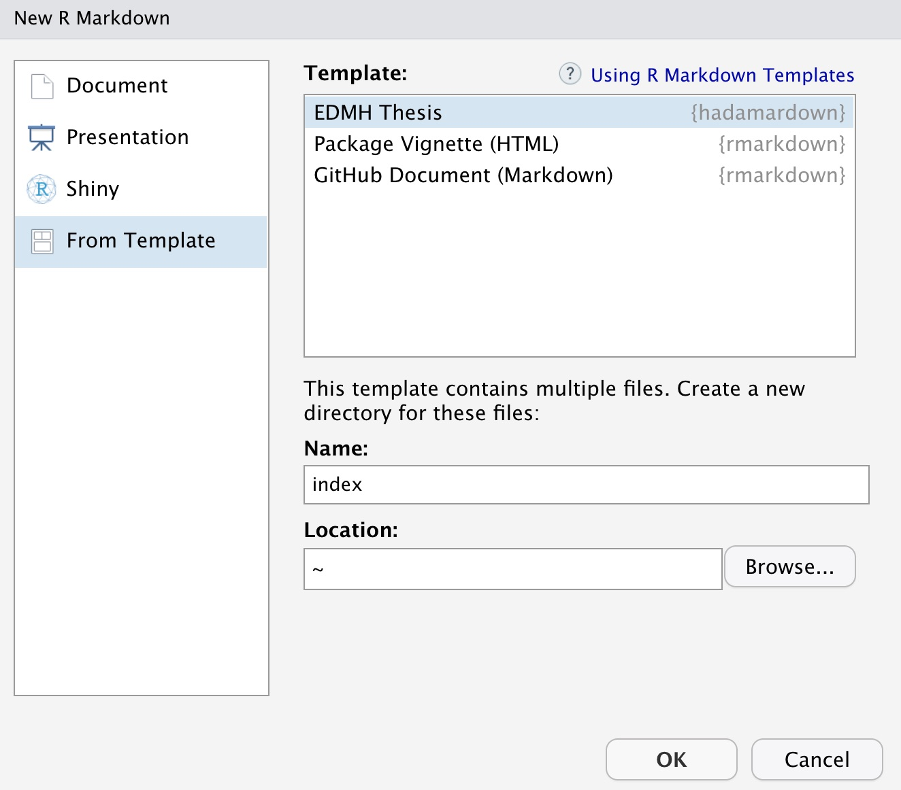

<!-- README.md is generated from README.Rmd. Please edit that file -->

```{r, include = FALSE}
knitr::opts_chunk$set(
  collapse = TRUE,
  comment = "#>",
  fig.path = "man/figures/README-",
  out.width = "100%"
)
```

# hadamardown

<!-- badges: start -->
```{r, echo = FALSE}
version <- as.vector(read.dcf('DESCRIPTION')[, 'Version'])
version <- gsub('-', '.', version)
```

[](https://www.tidyverse.org/lifecycle/#retired)
[](https://travis-ci.org/abichat/hadamardown)
)`-yellowgreen.svg)
<!-- badges: end -->

`r emo::ji("warning")` **Please note that this template is deprecated for both Université Paris-Saclay and Institut Polytechnique de Paris.**

New templates can be found [here](https://www.universite-paris-saclay.fr/fr/formation/doctorat/ecole-doctorale-de-mathematiques-hadamard-edmh#page-de-couverture-des-theses) and [there](https://www.ip-paris.fr/formation/doctorats/ecole-doctorale-ip-paris/#1568627927171-f29bf005-eee8) but there is no LaTeX files or R package implementing them (for the moment). 

<hr>

The **hadamardown** package provides a handy template to write a PhD thesis for **École Doctorale de Mathématiques Hadamard** with R and markdown. It is based on the [thesisdown](https://github.com/ismayc/thesisdown) package.

## Installation

You can install **hadamardown** from GitHub with:

```{r installation, eval=FALSE}
# install.packages("remotes")
remotes::install_github("abichat/hadamardown")
```


## Examples

Example for **Université Paris-Saclay**:

Front page            |  Back cover
:-------------------------:|:-------------------------:
  |  


Example for **Institut Polytechnique de Paris**:

Front page            |  Back cover
:-------------------------:|:-------------------------:
  |  


Official EDMH templates are provided [here](https://www.universite-paris-saclay.fr/fr/formation/doctorat/ecole-doctorale-de-mathematiques-hadamard-edmh#page-de-garde-des-theses-de-l-edmh).

The HTML output is the same as the [thesisdown one](https://thesisdown.netlify.com).

## Using hadamardown

You can find general documentation for [bookdown](https://bookdown.org/yihui/bookdown/) or [thesisdown](https://github.com/ismayc/thesisdown) on their respective pages.

Once you have LaTeX, RStudio and **hadamardown** installed on your computer (check [here](https://github.com/ismayc/thesisdown#using-thesisdown-from-chesters-github)), use 
`File > New File > R Markdown... > From template` and then select EDMH Thesis.

 

You need to use `index` for the name (to ensure you have a `index.html` file at the end) but you can change your directory name later. 


### Complete YAML

You need to fill these fields in the YAML to customize your manuscript according to EDMH standards:

* author, 
* date (of defense),
* title (in French and English),
* national number thesis (after the defense, for the second deposit),
* speciality,
* grouping institution with logo (Saclay or IPP),
* registration institution with logo,
* host institution with logo (if different from above),
* host laboratory with logo,
* rapporteurs,
* jurors by alphabetical order (after the defense only present jurors must be cited and the president must be indicated),
* keywords (in French and English),
* abstract (in French and English).

You can also add sections that will be dislayed only in the pdf output: abstract, acknowledgements, dedication and preface. 

Note that the logo size refers to image width. Do not hesitate to adapt it for your own manuscript.

### Available entities

These entities are available by default with their logo:

* Établissement de regroupement :
  * [Université Paris-Saclay](inst/rmarkdown/templates/edmh_thesis/skeleton/logos/edmhsaclay.jpg)
  * [Institut Polytechnique de Paris](inst/rmarkdown/templates/edmh_thesis/skeleton/logos/edmhipp.jpg)

* Établissement inscripteur :
  * [Centrale-Supélec](inst/rmarkdown/templates/edmh_thesis/skeleton/logos/centralesupelec.jpg)
  * [École des Hautes Études Commerciales de Paris](inst/rmarkdown/templates/edmh_thesis/skeleton/logos/hec.jpg)
  * [École Polytechnique](inst/rmarkdown/templates/edmh_thesis/skeleton/logos/polytechnique.jpg)
  * [École Nationale de la Statistique et de l'Administration Économique](inst/rmarkdown/templates/edmh_thesis/skeleton/logos/ensae.jpg)
  * [École Nationale Supérieure de Techniques Avancées](inst/rmarkdown/templates/edmh_thesis/skeleton/logos/ensta.jpg)
  * [École Normale Supérieure](inst/rmarkdown/templates/edmh_thesis/skeleton/logos/ensulm.jpg)
  * [École Normale Supérieure Paris-Saclay](inst/rmarkdown/templates/edmh_thesis/skeleton/logos/ensparissaclay.jpg)
  * [Télécom Paris](inst/rmarkdown/templates/edmh_thesis/skeleton/logos/telecomparis.jpg)
  * [Télécom SudParis](inst/rmarkdown/templates/edmh_thesis/skeleton/logos/telecomsudparis.jpg)
  * [Université d'Évry-Val d'Essonne](inst/rmarkdown/templates/edmh_thesis/skeleton/logos/ueve.jpg)
  * [Université Paris-Sud](inst/rmarkdown/templates/edmh_thesis/skeleton/logos/upsud.jpg)
  * [Université de Versailles Saint-Quentin-en-Yvelines](inst/rmarkdown/templates/edmh_thesis/skeleton/logos/uvsq.jpg)

* Établissement d'accueil :
  * [AgroParisTech](inst/rmarkdown/templates/edmh_thesis/skeleton/logos/agroparistech.jpg)
  * [Commissariat à l'Énergie Atomique et aux Énergies Alternatives](inst/rmarkdown/templates/edmh_thesis/skeleton/logos/cea.jpg)
  * [Institut des Hautes Études Scientifiques](inst/rmarkdown/templates/edmh_thesis/skeleton/logos/ihes.jpg)
  * [Institut National de la Recherche Agronomique](inst/rmarkdown/templates/edmh_thesis/skeleton/logos/inra.jpg)
  
* Laboratoire d'accueil :
  * [Centre de Mathématiques Appliquées de Polytechnique, UMR 7641 CNRS](inst/rmarkdown/templates/edmh_thesis/skeleton/logos/cmap.jpg)
  * [Centre de Mathématiques et de leurs Applications, UMR 8536 CNRS](inst/rmarkdown/templates/edmh_thesis/skeleton/logos/cmla.jpg)
  * [Centre de Mathématiques Laurent Schwartz, UMR 7640 CNRS](inst/rmarkdown/templates/edmh_thesis/skeleton/logos/cmls.jpg)
  * [Centre de Recherche en Économie et Statistique, UMR 9194 CNRS](inst/rmarkdown/templates/edmh_thesis/skeleton/logos/crest.jpg)
  * [Département de Mathématiques et Applications, UMR 8553 CNRS](inst/rmarkdown/templates/edmh_thesis/skeleton/logos/dma.jpg)
  * [Fédération de Mathématiques, FR 3487 CNRS](inst/rmarkdown/templates/edmh_thesis/skeleton/logos/fdm.jpg)
  * [Groupement de Recherche et d'Études en Gestion (GREGHEC), UMR 8071 CNRS](inst/rmarkdown/templates/edmh_thesis/skeleton/logos/greghec.jpg)
  * [Institut de Physique Théorique de Saclay, URA 2306 CNRS](inst/rmarkdown/templates/edmh_thesis/skeleton/logos/ipht.jpg)
  * [Laboratoire Alexander Grothendieck (ERL 9216 CNRS)](inst/rmarkdown/templates/edmh_thesis/skeleton/logos/lag.jpg)
  * [Laboratoire de Mathématiques et Modélisation d'Évry, UMR 8071 CNRS-INRA](inst/rmarkdown/templates/edmh_thesis/skeleton/logos/lamme.jpg)
  * [Laboratoire de Mathématiques d'Orsay, UMR 8628 CNRS](inst/rmarkdown/templates/edmh_thesis/skeleton/logos/lmo.jpg)
  * [Laboratoire de Mathématiques de Versailles, UMR 8100 CNRS](inst/rmarkdown/templates/edmh_thesis/skeleton/logos/lmv.jpg)
  * [Laboratoire Traitement et Communication de l'Information, UMR 5141 CNRS](inst/rmarkdown/templates/edmh_thesis/skeleton/logos/ltci.jpg)
  * [Mathématiques et Informatique Appliquées du Génome à l'Environnement, UR 1404](inst/rmarkdown/templates/edmh_thesis/skeleton/logos/maiage.jpg)
  * [Mathématiques et Informatique Appliquées, UMR 518 INRA](inst/rmarkdown/templates/edmh_thesis/skeleton/logos/mia.jpg)
  * [Services Répartis, Architectures, Modélisation, Validation, Administration des Réseaux, UMR 5157 CNRS](inst/rmarkdown/templates/edmh_thesis/skeleton/logos/samovar.jpg)
  * [Unité de Mathématiques Appliquées, ENSTA-CNRS-INRIA](inst/rmarkdown/templates/edmh_thesis/skeleton/logos/uma.jpg)

Please feel free to create an issue or a pull request if you notice a typo or a lack of updates in graphics guidelines or you want to contribute to the package.


