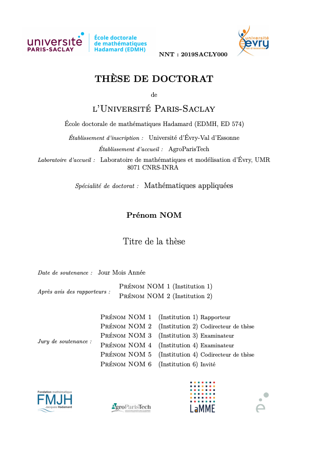

<!-- README.md is generated from README.Rmd. Please edit that file -->

```{r, include = FALSE}
knitr::opts_chunk$set(
  collapse = TRUE,
  comment = "#>",
  fig.path = "man/figures/README-",
  out.width = "100%"
)
```

# hadamardown

<!-- badges: start -->
[](https://www.repostatus.org/#concept)
<!-- badges: end -->

The **hadamardown** package provides a handy template for writing a thesis with R and markdown. It is based of the [thesisdown](https://github.com/ismayc/thesisdown) package.

**As of now, it is not finished.**

This is the first page of the pdf output. It must be like [this one](https://www.universite-paris-saclay.fr/sites/default/files/pagedegardetheseedmh-mars2017.pdf).


